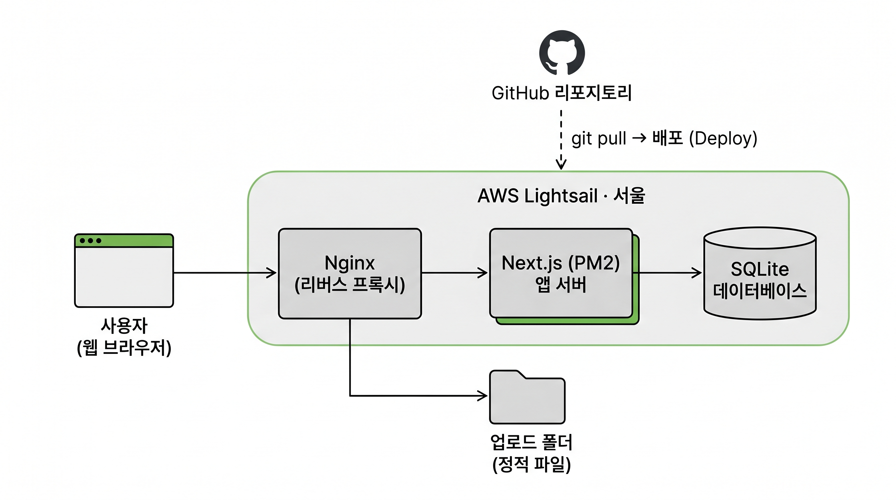

# ADDS — 학술 연구팀 홈페이지

연세대학교 SSK **ADDS(Alpha generation Digital Daily Survey)** 연구팀의 공식 홈페이지입니다.
알파 세대의 디지털 일상을 종단적으로 연구하는 팀의 연구 실적, 소식, 공지사항을 제공합니다.

## 기술 스택

- **Framework**: Next.js 14 (App Router) + React 18 + TypeScript
- **Database**: SQLite (better-sqlite3, WAL 모드)
- **Styling**: Tailwind CSS + Pretendard
- **Auth**: bcryptjs + UUID 세션 (24시간 만료)

## 주요 기능

- 연구 실적, 미디어, 공지사항을 한눈에 보는 메인 페이지
- 공지사항/소식 목록 (탭 전환, 검색, 페이지네이션)
- 첨부파일 업로드 및 다운로드 지원
- 관리자 전용 페이지 (게시글 CRUD, 세션 기반 인증)

## 시작하기

### 필요 환경

- Node.js 18 이상
- npm

### 설치 및 실행

```bash
# 의존성 설치
npm install

# 개발 서버 실행 (http://localhost:3000)
npm run dev

# 프로덕션 빌드 및 실행
npm run build
npm run start
```

DB 파일(`data/academic.db`)과 업로드 디렉토리(`public/uploads/`)는 첫 실행 시 자동 생성됩니다.

### 기본 관리자 계정

| 항목 | 값 |
|------|-----|
| URL | `/admin/login` |
| Username | `admin` |
| Password | `admin1234` |

> 실제 배포 시 반드시 변경해주세요.

## 프로젝트 구조

```
academic-portal/
├── app/                  # Next.js App Router
│   ├── page.tsx          # 메인 페이지
│   ├── notices/          # 공지사항 목록/상세
│   ├── admin/            # 관리자 페이지 (로그인 가드)
│   ├── api/              # API 라우트
│   └── components/       # 공통 컴포넌트 (Header, Footer)
├── lib/
│   ├── db.ts             # SQLite 연결 및 스키마 초기화
│   ├── notices.ts        # 공지사항 CRUD 헬퍼
│   └── auth.ts           # 인증/세션 관리
├── data/                 # SQLite DB 파일 (gitignore)
└── public/uploads/       # 썸네일/첨부파일 (gitignore)
```

## API

| 경로 | 메서드 | 설명 |
|------|--------|------|
| `/api/notices` | GET, POST | 목록(페이지네이션/검색/필터), 생성 |
| `/api/notices/[id]` | GET, PUT, DELETE | 단건 조회/수정/삭제 |
| `/api/auth` | POST, GET, DELETE | 로그인, 세션 확인, 로그아웃 |

자세한 아키텍처와 DB 스키마는 [CLAUDE.md](CLAUDE.md)를 참고하세요.

## 배포

이 프로젝트는 **AWS Lightsail** 환경에서 운영 중입니다.



- **서버**: Debian 12 + Node.js 20 + PM2 + Nginx
- **HTTPS**: Let's Encrypt (Certbot, 도메인 연결 시)
- **DB/업로드**: 서버 로컬 스토리지 (수동 DB 백업 권장)

### 코드 업데이트

서버에 접속해 배포 스크립트 한 줄로 끝납니다. (git pull → build → PM2 재시작 → 헬스체크)

```bash
# 로컬에서 원격 실행
ssh -i <키.pem> admin@<서버IP> './deploy.sh'

# 또는 서버 접속 후
./deploy.sh
```

스크립트 원본: [scripts/deploy.sh](scripts/deploy.sh)

## 라이선스

© 2026 College of Human Ecology of Yonsei. All rights reserved.
